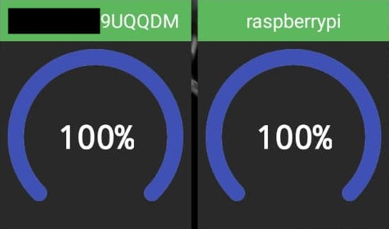
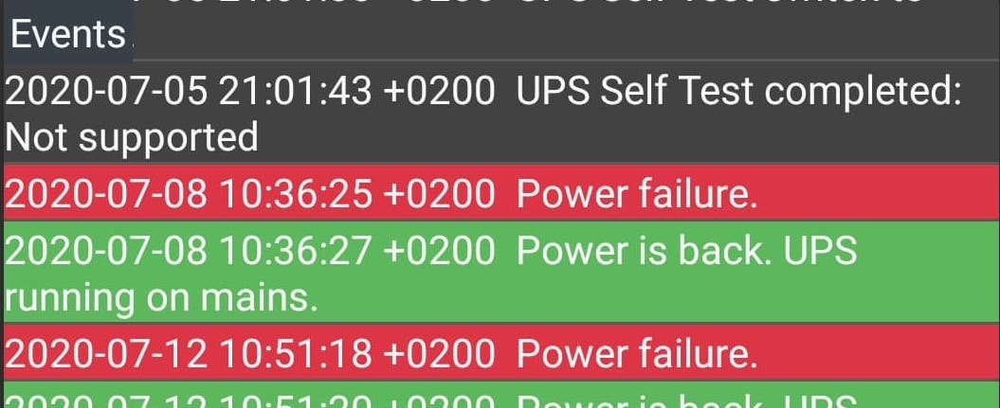

Upper image is a video link.

# APCUPSD Monitor

Android app for monitoring APC UPS devices statuses and view events. 
Watch Youtube video for better description. 
I brought this project on Github so other people can add features for their own use. 
See license and contribution rules below. 

Table of contents
=================
* [Images](#images)
* [Features](#features)
* [Requirements](#requirements)
* [Contributions](#contributions)
* [Authors](#authors)
* [Contributors](#contributors)
* [License](#license)

Images
============
Example of dark theme widget

Example of events

Features
============
* Basic status details viewer.
* Event logs viewer.
* Supports parsing data via SSH, APCUPSD Daemon NIS, Synology UPS, APC Network Management Card.
* Firebase based status check triggering and monitoring with notifications.
* Front screen widget support.
* Light and dark themes automatically following Android OS system theme.  

Requirements
============
1. Download and install Android Studio: https://developer.android.com/studio
2. You need virtual or physical phone.
3. Follow IDE instructions.
4. Open issue if something is unclear.

Contributions
============

* Feel free to add new features and fix bugs. I review pull requests and make releases when required.
* If you are planning to make new feature or bigger change, open issue and let's talk about it first.
Because it needs to serve everyone.
* If you feel my code is horrible, feel free to tell me about it. No hard feelings, lets improve together.
* Have huge need to write tests? you are really welcome to do so. Jenkinsfile has unit tests disabled because we have none.

Authors
============

* **Norkator** - *Initial work* - [norkator](https://github.com/norkator)

Contributors
============
None so far.

License
============
See repo license section or license file.

Permission to release this app on any Play Store as a new app is forbidden!
